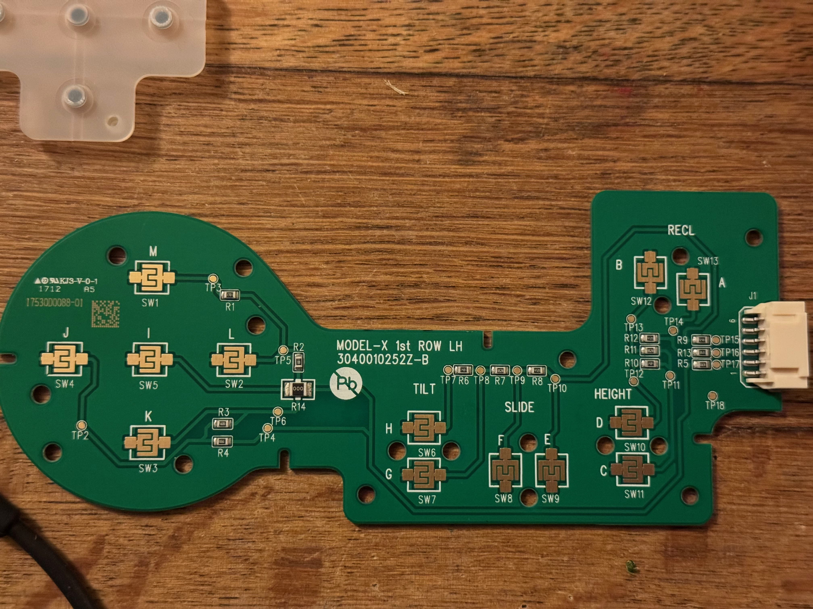
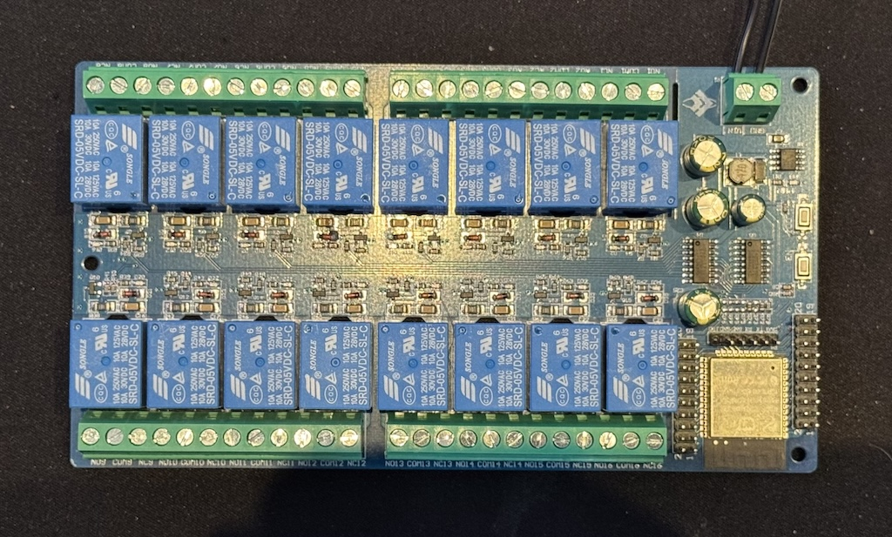

# ArduinoTeslaSeat

Using an ESP32 to read Tesla seat controls and power the motors through a relay board. Building my own playseat.

Please excuse my less-than-pretty procedural code, I've not done this in a while, as I normally work with Functional or OO languages. I might clean this up in the future, but probably not, since this is a hobby project ;P

**WARNING:** Please be mindful when messing with seat cables and harnesses, the airbag in a Tesla seat is an explosive device! On modern Tesla's these connectors are colored yellow. Prevent applying any kind of power to airbag _at all times_!

## Environment Variables

This project uses PlatformIO and can optionally have the following environment variables set for WiFi and Telnet access:

- `WIFI_SSID`: Your WiFi network name.
- `WIFI_PASSWORD`: Your WiFi password.
- `TELNET_PASSWORD`: Password for Telnet access.

Set these in your shell or PlatformIO environment before building/uploading.

## Telnet Capabilities

The ESP32 runs a Telnet server for remote control and monitoring. Connect to the ESP32's IP address on port 23 using a Telnet client (e.g., `telnet <ESP32_IP>`).

Once connected, authenticate with `auth <TELNET_PASSWORD>`. Available commands include:

- `help`: Show all available commands.
- `status`: Display current seat motor states and relay positions.
- `seat horizontal forward`: Move seat forward.
- `seat horizontal back`: Move seat backward.
- `seat vertical up`: Raise seat cushion.
- `seat vertical down`: Lower seat cushion.
- `back angle forward`: Recline back forward.
- `back angle back`: Recline back backward.
- `seat angle up`: Tilt seat up.
- `seat angle down`: Tilt seat down.
- `headrest up`: Raise headrest.
- `headrest down`: Lower headrest.
- `lumbar horizontal forward`: Inflate lumbar forward.
- `lumbar horizontal back`: Deflate lumbar backward.
- `lumbar vertical up`: Move lumbar up.
- `lumbar vertical down`: Move lumbar down.
- `relay <n> on|off`: Turn relay n (1-16) on/off.
- `calib`: Print raw ADC values for calibration.
- `demo`: Run relay demo sequence.
- `reboot`: Restart the ESP32.
- `r`: Repeat last command.

The Telnet interface allows real-time control without physical access, useful for testing and integration with external systems. Logs and events are also streamed over Telnet for debugging. Commands auto-stop after 500ms for safety.

## Tesla Seat Wiring

Tesla has _excellent_ wiring diagrams available **for free** on their website. You do need to create a (free) account. All Tesla models and model years available. I used the [Model X wiring diagrams](https://service.tesla.com/docs/ModelX/Circuit_Reference/) for my seat.

## Reading the seat controls

Tesla seat controls are incredibly simple. Each button has a resistor and is connected a signal line. There are 12 buttons on my Tesla Model X driver's seat, and 3 signal lines. I'm using the board in reverse (no problem, since resistors are passive), supplying 5V to the GND of the seat control keyboard, and measuring on the signal lines using the ADC's.

Each signal line is connected to an ADC input of your ESP32 through a voltage divider to ground. Google "voltage divider", it's basically one extra resistor to ground. The keyboard is our Vin and has an unknown resistance (depending on which buttons you are pressing. We're measuring at Vout. There should be a known value resistor between the measuring point and ground, set this in the code, I used 1k Ohm resistors.

ADC pins used: 34 (lumbar), 36 (seat vertical/back angle), 39 (seat horizontal/seat angle). Values are averaged over 10 readings with ±100 accuracy threshold. Out-of-range readings (<50 or >4000) are discarded.

Button mappings (approximate ADC values when using a 10k Ohm resistor from 3.3v as voltage dividor):
- Pin 39: Seat forward (1250), backward (300), angle up (3000), down (2150)
- Pin 36: Seat up (3000), down (2200), back forward (1250), back (300)
- Pin 34: Lumbar vertical up (3185), down (1875), horizontal forward (1125), back (2500)

## Driving Tesla seat motors

I couldn't get the seat module in my driver's side seat to function. I guess it needs a CAN or LIN connection to do something. I decided to cut the seat module out of the seat, and just drive the seat motors directly. I decided to do this with a cheap 16 relay board, allowing me to drive up to 8 DC motors.

  

Using mosfets or even ESC's might be a better idea, but I kept it simple.

The code is setup so that each motor direction has a pin, so for the 7 motors in my seat I require 14 pins / relais.

A relay does not simply switch between "off" and "connected", but switches between side A: "Normally Closed" and B: "Normally Open". On my relay board I have connected all "Normally Closed" sides to 12 volt negative/GND, and all "Normally Open" sides to 12 volt positive/PWR.

When I need to turn a motor, I close one of the relays. Close relay 1: turn in a direction, close relay 2: turn in the other direction.

When no relays are turned on, everything is grounded. In theory you could switch the sides around, because the motors won't turn either when everything is connected to 12 volt positive/PWR. But usually car's are chassis negative, so I stuck to that, since this reduces the chance of shorting something.

Please note that some motors share a wire, and you need to switch another relay to prevent activating two motors at once.

Relay board controlled via 74HC595 shift register: latch=12, clock=13, data=14, OE=5. Max 16 active relays at once.

Motor relay mappings:
- Seat horizontal: Forward (1 on, 2 off), Back (2 on, 1 off)
- Seat vertical: Up (7 on, 3/4 off), Down (3/4 on, 7 off)
- Back angle: Forward (3 on, 4/7 off), Back (4/7 on, 3 off)
- Seat angle: Up (5 on, 6 off), Down (6 on, 5 off)
- Headrest: Up (8 on, 16 off), Down (16 on, 8 off)
- Lumbar horizontal: Forward (13 on, 14/15 off), Back (14/15 on, 13 off)
- Lumbar vertical: Up (15 on, 13/14 off), Down (13/14 on, 15 off)
  - Note: Lumbar vertical doubles as headrest if seat moved horizontally recently (<10s)

## No headrest button?

The head rest on my seat does not have a dedicated button in the seat controls because Tesla's seat module automatically raises the headrest when moving the seat backwards (and vice versa). I might implement a custom button in the future, or imitate Tesla's feature if I implement the seat position sensors.

## Reading Tesla seat position sensors

I haven't got around to this yet, but all motors have hall sensors, so could possibly be read by an ESP32. You could implement seat memory with this.

## Reading the seat belt buckle sensor

Not implemented.

## Seat heating

Not implemented. Though easily possible with the existing relays. Would only have "full power" or "off". For regulating heat you'd need to read the seat temperature sensors and use mosfet's / PWM signals to modulate the heat. Relays are not suited for repeated fast switching due to a limited lifetime.

## Other Features

- WiFi auto-off after 15min inactivity to save power (and add security); restarts on activity.
- Calibration: `calib` prints raw ADC values on pins 32-39.
- Demo: `demo` cycles all relays on/off sequentially, don't do this with chair connected (:
- Logging: Dual output to Serial and Telnet.
- Loop: Fast polling (every 2ms) for controls; Telnet every 100ms; WiFi check every 5s.

## Building and Uploading

Use PlatformIO: `pio run --target upload` (auto-detects USB port).